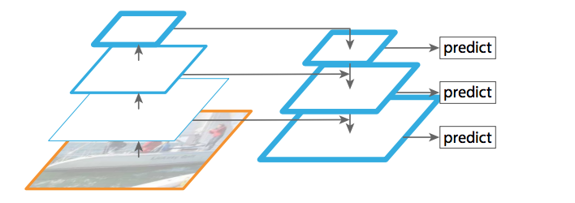
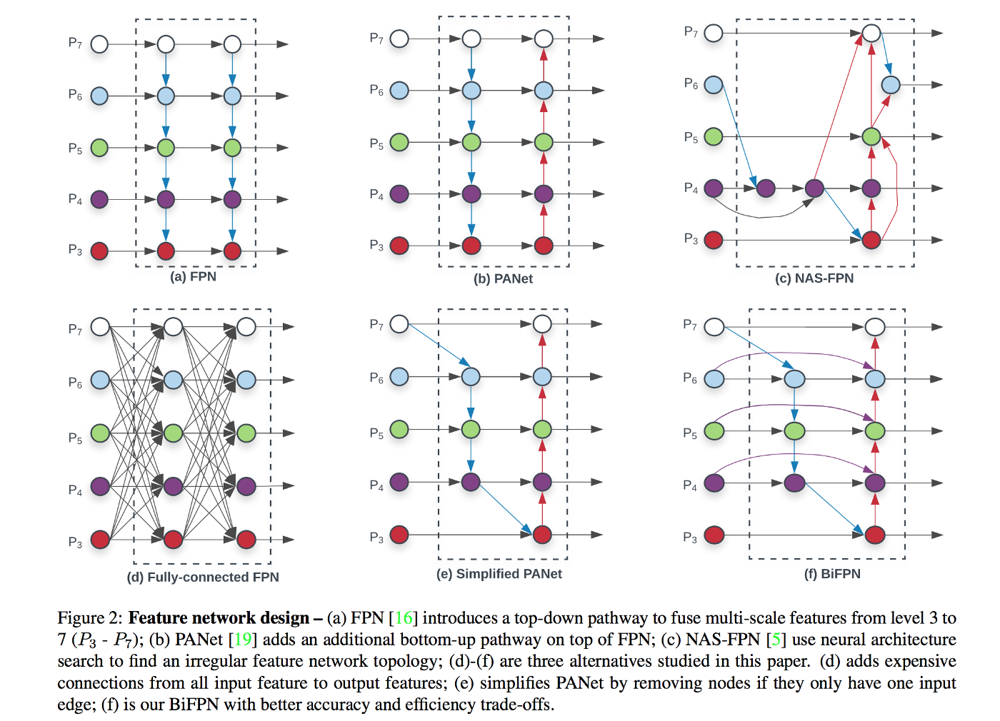
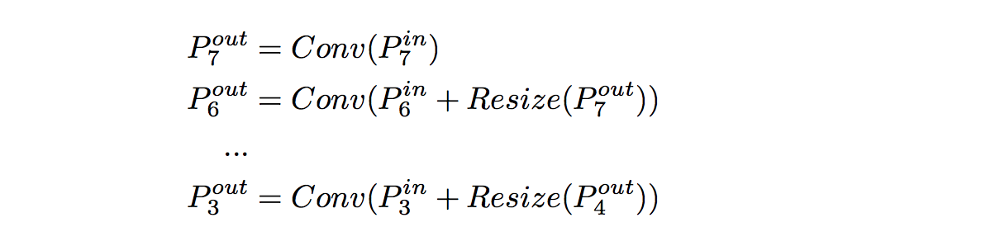

- [Original Link - EfficientDet: Scalable and Efficient Object Detection](https://medium.com/@nainaakash012/efficientdet-scalable-and-efficient-object-detection-ea05ccd28427)

## EfficientDet: 可拓展的和有效的目标检测
- 目标检测发展了很长的一段时间。由目标检测中的比较琐碎的计算机视觉技术发展到高级的目标检测器，这个改进非常的巨大。卷积神经网络(CNNs)，在这次变革中担任了一个非常重要的角色。我们希望我们的检测器的精度尽可能的高，并且尽可能的快，能够做到实时。但这个两个指标(精度和速度)存在一个权衡，而大多数的检测器都是在其中一个指标表现好，另外一个指标的表现则相对较差的。通常地，精度更高的检测器需要更多的计算量，但这不是一个很好的应用场景。所以，我们在不断寻求更高效的检测模型。这篇来自谷歌大脑团队的论文提出了一个新的检测器家族，它们是更加**高效的**，更加准确的和更快的。

### 为什么我们在讨论效率？
- 我们想到的一个比较自然的问题就是，为什么我们那么在乎效率呢？我们不是更应该考虑检测器的精度吗？总之，我们知道有些技术像[**Global Filter Pruning**](https://medium.com/@nainaakash012/gate-decorator-global-filter-pruning-afc12fcc71c6)，是能够用来压缩大的模型的。

- 那么，以上这些讨论都是有道理的。尽管你能够通过剪枝来压缩大模型，但它是一个多阶段的操作，并且无论模型多小，肯定存在精度的损失。过去几年检测器的改进有了非常大的进步，但是我们仍然没有探索出一种从0开始设计一个有效的检测模型的方法。在[**EfficientNet**](https://medium.com/@nainaakash012/efficientnet-rethinking-model-scaling-for-convolutional-neural-networks-92941c5bfb95)论文中展示了如何拓展CNNs，它对目标检测器中高级研究是有贡献的，另外，在实际应用场景中，例如机器人和无人驾驶汽车，**模型大小，内存占用和延迟性**对模型的部署来说尤为重要。

### 这篇论文的贡献
- 本篇论文只要提出了以下3点贡献：
  - (1) **BiFN**，一个双向权重特征网络，用来进行简单和快速多尺度特征融合。
  - (2) **Compound scaling**，一种新的方法，它能够按照某种规则联合向上拓展的backbone，特征网络，box/class 网络和分辨率。
  - (3) **EfficientDet**，一种新检测器家族，能够在一系列的资源限制下，得到非常好的精度和效率。

- 这篇论文主要是在一系列的资源限制中建立了一个可拓展的，高精度和高效率的检测器架构。(譬如，从3B到300B FLOPS). 它主要尝试解决以下2个方面的挑战：
  - (1). **Efficient multi-scale feature fusion, 高效的多尺度特征融合**, FPN, 特征金字塔已经成为了融合多尺度特征的主要方法。一些用到FPN的检测器包括： RetinaNet, PANet, NAS-FPN等等。大多数适应这些检测器的融合策略在进行融合时都没有考虑到filters的重要性。他们毫无分别的堆叠它们。实际上，并不是所有的特征对输出特征有同等的贡献的。所以，我们需要一个更好的融合测率。
  - (2). **Model Scaling， 模型缩放**，前人的大多数工作都是使得backbone更大，以得到更好的精度。论文作者发现在同时关注精度和速度的同时增大特征网络和box/class预测网络也显得尤为重要。受[**compound scaling in EfficientNets**](https://medium.com/@nainaakash012/efficientnet-rethinking-model-scaling-for-convolutional-neural-networks-92941c5bfb95)的启发，作者提出了一个目标检测器的混合缩放方法，它是通过联合增大所有backbone，特征网络，box/class预测网络的分辨率，深度和宽度。
  
- 让我们逐个点逐个点来具体分析，从而更好的理解这边论文吧。

### 特征金字塔网络(FPNs)
- 在讨论特征金字塔之前，我们先来回顾一下FPN的思路和讨论一下它的优缺点。尽管FPN并不是一个新东西，最先提出在deep CNN中利用深层多尺度堆叠的特征金字塔是2017年的这篇[**论文**](https://zpascal.net/cvpr2017/Lin_Feature_Pyramid_Networks_CVPR_2017_paper.pdf)。

- 
- 等等，等等。在讨论FPNs之前，你能够详细描述一下为什么我们那么需要它吗？为什么我们需要所有的特征组合起来呢？
- Great question. 在目标检测中，其中的一个难题是，在不同的场景检测不同大小的物体。早期人们习惯使用特征图片金字塔(Featurized Image Pyramids)，在图片金字塔上进行特征提取来尝试解决这个问题。这些金字塔某种意义上来说是尺度无光的(scale-invariant)，也就是说物体大小的变化是通过图片金字塔来变换的。实际上，这种特性使得模型能够通过位置和金字塔水平的图片进行扫描，来大范围的识别物体不同的大小。尽管这是有效的，但是在计算量上是非常耗时的，且只能够用在测试阶段，这就在训练和测试阶段造成了一个不匹配。

- 只有傻子才会在2019使用图片金字塔。我们的CNNs在哪里呢？？！

- CNNs，一方面能够表示到高层的语义信息之外，更重要的是它对大小变化是具有鲁棒性的，所以通过单输入大小得到的特征比较容易在识别中使用。然而这还是不够的，CNNs的一个最奇妙的东西是不同layer在不同levels和不同scale上计算计算特征图。(可以看到上图的左边部分)。这个网络中的特征堆叠有一个与生俱来的多尺度的，金字塔的形状。

- 噢，我知道了！CNNs是真爱啊。它们提供了一个简单的解法。所以，就有了现在的所谓的特征金字塔了。那么问题解决了吗？

- 尽管我们现在能在不同的层(layer)得到不同大小的特征图(feature map)，但是不同深度的特征图有不同的语义信息。通常，高分辨率的特征图包含更清晰的低级特征，却没有很好的高级语义表达能力，对物体识别不利。

- Hmm, 我知道问题了。CNN中的高分辨率特征图包含低级语义信息，而低分辨率特征图包含高级语义信息，我们需要在不同的层把它们结合起来用以构建更鲁棒的检测器。

- 是的！FPNs就是通过自底向上，再由自顶向下的方式来侧面连接实现的。简短的说，高级特征先进行上采样，然后在和低级特征通过横向连接（先summation, 再1x1卷积）。如果想要更多详细信息，请阅读原[论文](https://zpascal.net/cvpr2017/Lin_Feature_Pyramid_Networks_CVPR_2017_paper.pdf)。

- 好的，如果FPNs做了我们需要的，那么**BiFPN**到底又是什么，我们需要它来做什么呢？

### BiFPN
- 如果我们讨论如何修改FPNs，那么直接使用它肯定是有缺点的。我们举个例子来详细说明它吧。
- 

- 传统的FPN通过自顶向下的方式结合了不同大小的特征：
- 

- 上图2(a)中，FPN存在的问题是它是之限制一个流向的信息(自顶向下)。为了解决这个问题，[PANet](https://arxiv.org/pdf/1803.01534.pdf)加入了另外一个自底向上的集成网络，就是上图2(b)所示。另外，还有很多的论文，譬如，NAS-FPN，也是在研究通过交叉连接来捕获更好的语义信息的。总的来说，其实就上下连接的游戏，自顶向下或者子弟向上来获得更有好的语义信息。

- 如果他们使用了NAS来查找了一个更好的网络拓扑结构，那么他们不是应该已经找到了最好的网络了吗？

- NAS的问题在于，它是基于强化学习，在GPU/TPU上运行1000多小时来找到最佳的网络连接。另外，如图2(c)中，它发现在NAS的最后的交叉连接是不规则的和难以解析的。即使这样，PANet在精度方面也能够打败FPN和NAS-FPN，但是需要额外的计算开销。所以，用PANet作为基准，然后为上面的连接做精度和速度的改进。为了实现优化的交叉连接，作者提出了以下信息：
  - (1) 删除只有一个输入的结点。如果一个结点只有一个输入边，而没有特征融合，那么它对用来融合不同特征的特征网络是没有贡献的。这就引出了一个简化的PANet，如上图2(e)。
  - (2) 在原来的输入到输出结点加入一条额外的边，如果它们是在同一层(same level)的话，为了融合更多的特征，而没有增加更多的计算开销，如上图2(f)所示。
  - (3) 不像PANet，只有一个top-down和bottom-up的路径，作者把每一个双向的路径(top-down & bottom-up)当成一个特征网络层(feature network layer)，然后重复多次相同的层，这样就融合了更多高级的特征。这些优化的结果就是图2(f)中的新的特征网络，称之为**BiFPN**。
  
- 当我们开始讨论，你会说早期的论文在融合特征时，把所有的特征都是看成平等的，但这并不是最优的。在上面的框架中，你必须优化连接，特征还是权重平等的。你疯了吧？

### 权重特征融合
- 我之前说过，早期的工作

